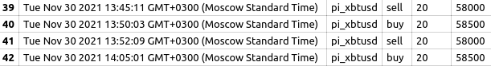
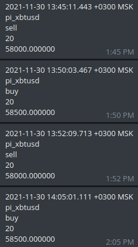

# Курсовой проект TFS: Golang 2021

**Целью** курсового проекта является написание торгового бота на платформе [kraken-demo](https://futures.kraken.com/ru.html). Демонстрационная платформа не требует никаких персональных данных при регистрации и выполняет заявки в песочнице, не требуя никаких реальных средств для взаимодействия с платформой.

## Описание

В глобальном плане бот является клиентом биржи. Он получает свечи по Websocket-соединению и на основании решения индикатора выставляет ордера на покупку / продажу.  
Формально, бот является веб-сервером. Управление им происходит через HTTP протокол.
Так, можно задать торговую пару и период, по которым будут приходить свечи, установить объём торгов - сумму в USD, на которую будут совершаться сделки. Также есть возможность конфигурировать индикатор. Начало и отсановка работы бота реализуются через соответствующие эндпоинты.

## Бизнес-логика

Процесс торговли реализован в виде конвеера. Начало конвеера - поток свечей с биржи. Эти свечи идут на вход к индикатору, который анализирует свечку и посылает сигнал на покупку, продажу или удержание актива. На основании сигнала, происходит покупка или продажа на бирже. Выполненный ордер записывается в базу данных и чат в telegram.


## Индикатор MACD

Индикатор MACD является, так называемым, трендовым осциллятором, сочетающим в себе свойства и трендового индикатора, и осциллятора. Рассчитывается MACD на основании скользящих средних.  
Для расчета используются три экспоненциальные скользящие средние с разными периодами. Из быстрой скользящей средней с меньшим периодом $EMA_s$ вычитается медленная скользящая средняя с большим периодом $EMA_i$. По полученным значениям строится линия MACD.
$$MACD = EMA_s(P)-EMA_i(P)$$
Далее полученная линия сглаживается третьей экспоненциальной скользящей средней. $EMA_a$, и получается сигнальная линия MACD(Signal).
$$Signal = EMA_a(EMA_s(P) - EMA_i(P))$$
Основным сигналом является пересечение линий MACD и Signal. Когда основная линия MACD пересекает сигнальную линию снизу-вверх, это сигнал на покупку. Пересечение сверху-вниз, сигнал для продажи.

Как известно, для инициализации $EMA_n$ необходимо простое скользящее среднее $SMA_n$ за этот период.  А значит для инициализации индикатора MACD необходимо $a + i$ свечей, где $a$ - больший период линии MACD, $i$ - период сигнальной линии.

## REST API

### Start   
Запуск бота

**URL** : `/bot/start`  
**Method** : `POST`  
**Body** : `None`  

#### Success Response
**Condition**: Параметры биржи и индикатора заданы правильно.   
**Code**: `200 OK`   
**Body** `Ok`   


#### Error Response 
**Condition**: Бот уже запущен   
**Code**: `400 Bad Request`   
**Body**: `The bot has already been started`


#### Error Response   
**Condition**: Параметры биржи или индикатора заданы неправильно.  
**Code**: `400 Bad Request`   
**Body**: `Not all necessary parameters are set`  

### Stop   
Остановка бота   

**URL** : `/bot/stop`   
**Method** : `POST`   
**Body** : `None`   

#### Success Response  
**Condition**: Бот в работе.  
**Code**: `200 OK`   
**Body** `Ok`  

#### Error Response   
**Condition**: Остановка бота до старта.  
**Code**: `400 Bad Request`  
**Body**: `The bot has not been started yet`

### ConfigurateExchange
Настройка параметров биржи. Можно задавать только когда бот остановлен.   

**URL** : `/bot/exchange/config`   
**Method** : `POST`   
**Body** : 
```json 
{
    "symbol":"pi_xbtusd",  
    "period":"1m",  
    "amount":20
}
```
#### Success Response  
**Condition**: Параметры установлены.  
**Code**: `200 OK`   
**Body** `Ok`  

#### Error Response   
**Condition**: Бот запущен.  
**Code**: `400 Bad Request`  
**Body**: `It isn't possible to change this params during the work`   

#### Error Response   
**Condition**: Неправильное тело запроса.  
**Code**: `400 Bad Request`  
**Body**: `Invalid Body`   


### ConfigurateIndicator
Настройка параметров индикатора. Можно задавать только когда бот остановлен.   
**URL** : `/bot/indicator/config`   
**Method** : `POST`   
**Body** :  
```json
{
    "fast":10,
    "slow":25,
    "signal":9,
    "source":"o"
}
```
#### Success Response  
**Condition**: Параметры установлены.  
**Code**: `200 OK`   
**Body** `Ok`  

#### Error Response   
**Condition**: Бот запущен.  
**Code**: `400 Bad Request`  
**Body**: `It isn't possible to change this params during the work`   

#### Error Response   
**Condition**: Неправильное тело запроса.  
**Code**: `400 Bad Request`  
**Body**: `Invalid Body`   


### ChangeSourceIndicator

Настройка источника цен у индикатора.   
**URL** : `/bot/indicator/change_source`   
**Method** : `POST`   
**Body** :  
```json
{
    "source":"c"
}
```

#### Success Response  
**Condition**: Источник изменен.  
**Code**: `200 OK`   
**Body** `Ok`   

#### Error Response   
**Condition**: Неправильное тело запроса.  
**Code**: `400 Bad Request`  
**Body**: `Invalid Body`   


## Пример запуска  

1. Запускаем приложение.
2. Необходимо написать /start в телеграм чат-боту.
3. Задаем параметры биржи:
   ```bash
   curl -v -X POST -H "Content-Type: application/json" --data '{"symbol":"pi_xbtusd","period":"1m","amount":20}' localhost:8000/bot/exchange/config
   ```
4. Задаем параметры индикатора:
   ```bash
   curl -v -X POST -H "Content-Type: application/json" --data '{"fast":10,"slow":25,"signal":9, "source":"o"}' localhost:8000/bot/indicator/config
   ```
5. Запускаем бота:
   ```bash
    curl -v -X POST localhost:8000/bot/start
   ```

6. Меняем источник индикатора:
   ```bash
   curl -v -X POST -H "Content-Type: application/json" --data '{"source":"c"}' localhost:8000/bot/indicator/change_source
   ```

7. Останавливаем бота:
   ```bash
        curl -v -X POST localhost:8000/bot/stop
    ```

8. Задаем новую торговую пару и объём:
    ```bash
        curl -v -X POST -H "Content-Type: application/json" --data '{"symbol":"pi_ethusd","period":"1m","amount":100}' localhost:8000/bot/exchange/config
    ```

9. Изменяем параметры индикатора:
    ```bash
        curl -v -X POST -H "Content-Type: application/json" --data '{"fast":12,"slow":26,"signal":9, "source":"C"}' localhost:8000/bot/indicator/config
    ```

10. Запускаем бота:
    ```bash
        curl -v -X POST localhost:8000/bot/start
    ```

11. Отсанавливаем бота:
    ```bash
        curl -v -X POST localhost:8000/bot/stop
    ```


    Пример записей из базы данных:
    

    Пример сообщения в telegram:   
    